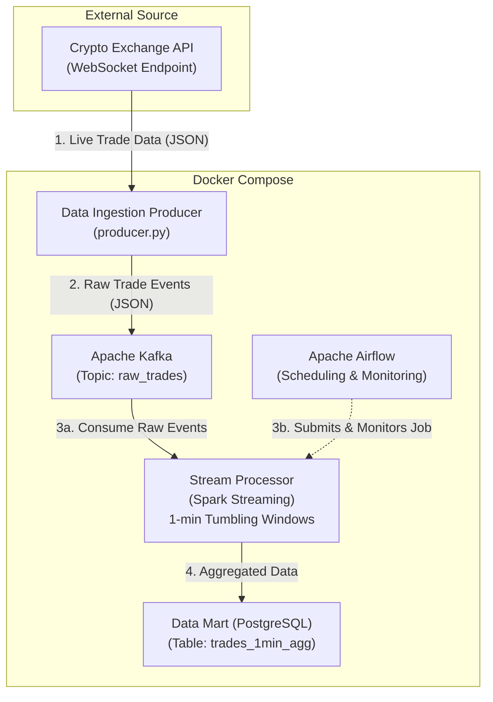

# Real-Time Crypto Trading Analytics Pipeline

[](https://www.python.org/)
[](https://spark.apache.org/)
[](https://kafka.apache.org/)
[](https://airflow.apache.org/)
[](https://www.postgresql.org/)
[](https://www.docker.com/)
[](https://opensource.org/licenses/MIT)

A streaming data pipeline for real-time cryptocurrency trade data processing. This project demonstrates modern data engineering concepts using a containerized microservices architecture with Apache Spark, Kafka, and Airflow.

## Table of Contents

- [Core Technologies](#core-technologies)
- [Architecture](#architecture)
- [How to Run the Pipeline](#how-to-run-the-pipeline)
  - [Build and Start All Services](#1-build-and-start-all-services)
  - [Configure Airflow Connections](#2-configure-airflow-connections-one-time-setup)
  - [Start the Pipeline](#3-start-the-pipeline)
- [Monitoring & Verification](#monitoring--verification)
- [How to Stop the Pipeline](#how-to-stop-the-pipeline)
- [Project Structure](#project-structure)
- [License](#license)

## Core Technologies

- **Data Ingestion**: Python, Binance WebSocket API
- **Message Broker**: Apache Kafka
- **Stream Processing**: Apache Spark (Structured Streaming)
- **Data Storage**: PostgreSQL
- **Orchestration & Monitoring**: Apache Airflow
- **Containerization**: Docker & Docker Compose

## Architecture

The data flows from a live exchange feed through Kafka, is processed in real-time by Spark, and is stored in a PostgreSQL database. Airflow manages the submission and monitoring of the Spark job.



## How to Run the Pipeline

### 1. Build and Start All Services

From the project's root directory:

```bash
docker-compose up --build -d
```

This will start the following services:

- **Zookeeper**: Kafka coordination service
- **Kafka**: Message broker for streaming data
- **PostgreSQL**: Database for storing aggregated data
- **pgAdmin**: Web interface for database management
- **Producer**: Python service that ingests live crypto data
- **Spark Master**: Spark cluster master node
- **Spark Worker**: Spark cluster worker node
- **Airflow Init**: Initializes Airflow database and creates admin user
- **Airflow Webserver**: Web interface for pipeline monitoring
- **Airflow Scheduler**: Schedules and monitors DAGs

### 2. Configure Airflow Connections (One-Time Setup)

The Airflow DAGs need to know how to connect to PostgreSQL.

1. Navigate to the **Airflow UI**: [http://localhost:8081](http://localhost:8081)
2. Login with username `admin` and password `admin`.
3. Go to **Admin -> Connections**.

4. **Create the PostgreSQL Connection:**
    - Click the `+` button to add a new connection.
    - **Connection Id:** `crypto_pipeline_postgres`
    - **Connection Type:** `Postgres`
    - **Host:** `postgres`
    - **Database:** `crypto_data`
    - **Login:** `user`
    - **Password:** `password`
    - **Port:** `5432`
    - Click **Save**.

### 3. Start the Pipeline

1. In the Airflow UI, go to the **DAGs** view.
2. Find the `crypto_pipeline_submit_dag` and un-pause it using the toggle on the left.
3. Click on the DAG name, then click the "Play" button to trigger it manually. This will submit the Spark job.
4. Find the `crypto_pipeline_monitor_dag` and un-pause it. This DAG will now run automatically every 5 minutes to monitor the pipeline.

## Monitoring & Verification

- **Producer Logs**: Check that the producer is successfully publishing messages.

    ```bash
    docker logs -f producer
    ```

    You should see logs like `Published trade to Kafka: ...`

- **Spark Master UI**: [http://localhost:8080](http://localhost:8080)
  - You should see one "Running Application" corresponding to our `CryptoAnalytics` job.

- **Airflow UI**: [http://localhost:8081](http://localhost:8081)
  - The `crypto_pipeline_submit_dag` should have a successful run.
  - The `crypto_pipeline_monitor_dag` should have successful runs every 5 minutes.

- **pgAdmin (Database UI)**: [http://localhost:5050](http://localhost:5050)
  - Add a new server connection:
    - **Host:** `postgres`
    - **Port:** `5432`
    - **Username:** `user`
    - **Password:** `password`
  - Navigate to `crypto_data -> Schemas -> public -> Tables -> trades_1min_agg`.
  - Right-click the table and select "View/Edit Data" -> "All Rows". You should see aggregated data appearing and updating every minute.

## How to Stop the Pipeline

To stop all running containers and remove the network, run:

```bash
docker-compose down
```

To stop the containers AND remove all persisted data (PostgreSQL data, pgAdmin data, named volumes), use the `-v` flag:

```bash
docker-compose down -v
```

## Project Structure

```plaintext
/crypto-trading-data-pipeline/
|
├── .gitignore
├── docker-compose.yml
├── README.md
|
├── producer/
│   ├── Dockerfile
│   ├── producer.py
│   └── requirements.txt
|
├── spark_processor/
│   ├── Dockerfile
│   ├── processor.py
│   └── requirements.txt
|
├── airflow/
│   ├── dags/
│   │   ├── crypto_pipeline_monitor_dag.py
│   │   └── crypto_pipeline_submit_dag.py
│   ├── Dockerfile
│   └── requirements.txt
|
└── postgres/
    └── init/
        └── init.sql
```

## License

This project is licensed under the MIT License - see the [LICENSE](LICENSE) file for details.
